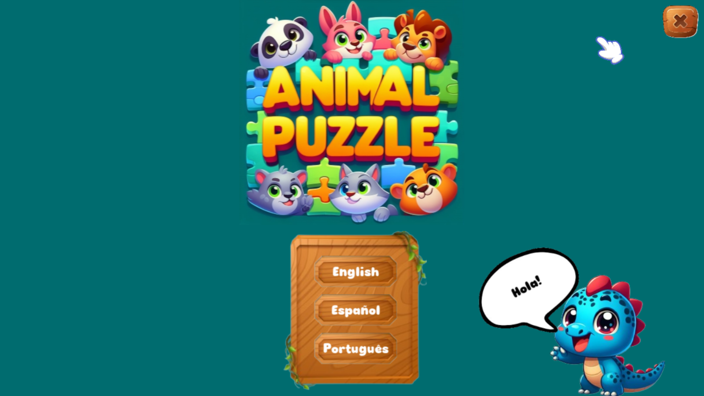
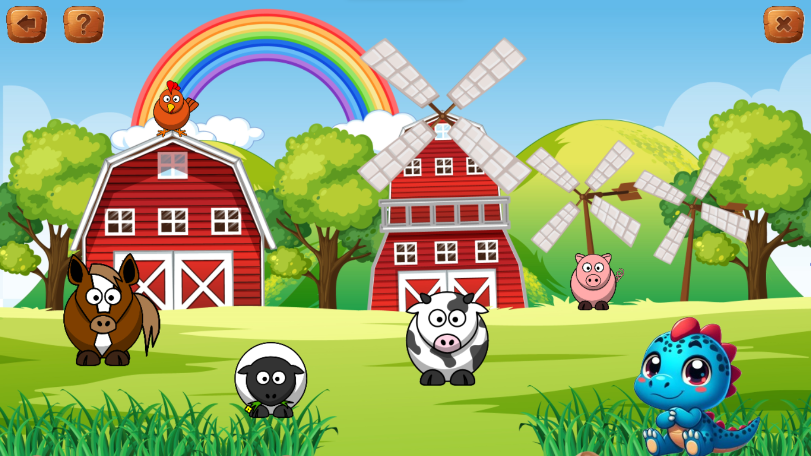

# Animal Puzzle

#### Description:
Animal Puzzle is a small point and click game I made for my 2 year old toddler to get him started with videogames.

The game can be played in English, Spanish or Portuguese which are the three languages we speak at home.
A cute Dino assistant guides you through the game, greeting you and asking you questions.

#### Technical:
This was my first personal project using Love2D and Lua. I took the opportunity to learn and implement some gamedev concepts despite
the project being relatively simple.

The project uses a StateStack to manage the gameplay flow and a StateMachine to manage the different states of the dino assistant.

#### How to run it:
To run the game you will need to download the Love2D framework and execute the game using it. To do so you can simply drag and drop the game folder
into the Love2D executable.

#### Some screenshots of the game:

